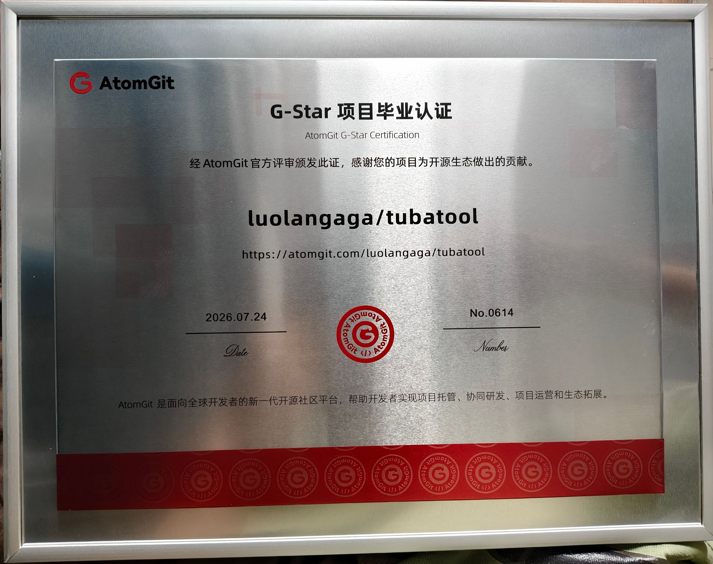

<div align="center">

English | [中文](README.md)


## ⚠️ Warning: The English translation is AI-generated and may contain inaccuracies.

# TubaWinUi3 — PC Hardware Toolbox

**A rebuilt version of Tuba Toolbox** — Powered by WinUI 3 / .NET 10

<a href="https://readme-typing-svg.demolab.com?font=Fira+Code&size=28&pause=1000&color=0078D4&center=true&vCenter=true&width=600&lines=PC+Hardware+Toolbox;WinUI+3+%C2%B7+.NET+10;82+Tools+%C2%B7+One-Click+Launch">

</a>

[](LICENSE)
[](https://dotnet.microsoft.com/)
[](https://learn.microsoft.com/windows/apps/winui/)
[](https://github.com/luolangaga/tubatool)
[](https://gitcode.com/luolangaga/tubatool)
[](https://github.com/luolangaga/tubatool)

<a href="https://trendshift.io/repositories/51042?utm_source=trendshift-badge&utm_medium=badge&utm_campaign=badge-trendshift-51042" target="_blank" rel="noopener noreferrer"></a>
<a href="https://trendshift.io/repositories/51042?utm_source=trendshift-badge&utm_medium=badge&utm_campaign=badge-trendshift-51042" target="_blank" rel="noopener noreferrer"></a>

[Official Docs](https://tubawinui3.cn) | [Download](https://github.com/luolangaga/tubatool/releases) | [Issues](https://github.com/luolangaga/tubatool/issues) | [Discussions](https://github.com/luolangaga/tubatool/discussions)


</div>

---

> **Note:** There are many unofficial download sources recently — please verify authenticity before downloading! Only use the official channels listed under [Installation](#installation).

---

## AtomGit G-Star Graduated Project

This project has passed the official review of [AtomGit](https://atomgit.com) and received the **G-Star Graduation Certification** (No.0614, 2026.07.24), in recognition of its contribution to the open-source ecosystem.

Follow us on AtomGit: **[atomgit.com/luolangaga/tubatool](https://atomgit.com/luolangaga/tubatool)**

<div align="center">



</div>

---

## Table of Contents

- [AtomGit G-Star Graduated Project](#atomgit-g-star-graduated-project)
- [Feature Highlights](#feature-highlights)
- [Built-in Tools](#built-in-tools)
- [Bundled Tools](#bundled-tools)
- [Installation](#installation)
- [System Compatibility](#system-compatibility)
- [Build from Source](#build-from-source)
- [Community](#community)
- [Contributors](#contributors)
- [License](#license)

---

## Feature Highlights

<table>
<tr>
<td width="50%">

**One-Click Tool Launch**
Automatically scans the `Tools/` folder, displays by category, click to run, with real-time search

</td>
<td width="50%">

**Hardware Info & Live Monitoring**
Real-time CPU / GPU / memory / disk temperature, frequency, and power monitoring

</td>
</tr>
<tr>
<td width="50%">

**AI Assistant**
Built-in intelligent agent that can diagnose issues, tweak settings, read/write files, and run commands

</td>
<td width="50%">

**Format Converter**
Convert images / audio & video / Word / Excel / PPT / PDF, with OCR and PDF merge & split

</td>
</tr>
<tr>
<td width="50%">

**Game Monitor**
Customizable FPS / temperature / load overlay, shown live while gaming

</td>
<td width="50%">

**Junk Cleaner**
Winapp2 rule-driven deep cleanup of app caches, temp files, and registry leftovers

</td>
</tr>
<tr>
<td width="50%">

**Benchmark & Ranking**
CPU / GPU stress tests with PDF reports and community cloud leaderboards

</td>
<td width="50%">

**Everyday Essentials**
Favorites / Run as Administrator / Desktop shortcuts / Auto update / Light & dark themes

</td>
</tr>
</table>

---

## Built-in Tools

> Native tools built with Fluent Design — no third-party software required

**45 built-in tools** covering system optimization, hardware detection, network diagnostics, gaming, and more:

| Category | Count | Representative Tools |
|:--------:|:-----:|:---------------------|
| **System Tools** | 16 | Junk Cleaner / AI Assistant / Rogue Cleaner / Startup Manager / Malware Blocker |
| **Hardware Tools** | 14 | Benchmark / New PC Setup Wizard / Disk Health / Stress Test / Format Converter |
| **Network Tools** | 8 | Speed Test / LAN File Share / Traffic Monitor / Network Optimizer |
| **Gaming Tools** | 3 | Game Monitor / Runtime Repair / 3D Anti-Motion Sickness |
| **Utilities** | 4 | PC Tutorial / Official Websites / Service Center Locator / Community Tools |

<details>
<summary>Click to expand full tool list</summary>

### System Tools
- **AI Assistant** — Intelligent agent that can diagnose issues, tweak settings, read/write files, run commands, and search the web
- **Malware Blocker** — Blocks rogue software installs and runs by adding vendor certificates to the system untrusted list
- **Malware Sandbox** — Sandboxie-Plus environment to safely run and analyze suspicious programs; delete the sandbox to restore the system
- **Rogue Cleaner** — Scans and cleans rogue context menus, auto-starts, scheduled tasks, services, browser extensions, and file-association leftovers
- **Junk Cleaner** — Winapp2 rule-based scanning and cleanup of app caches, temp files, and registry leftovers
- **Startup Manager** — Scans auto-start entries (registry Run, startup folders, scheduled tasks, services) to spot abnormal ones
- **Context Menu Manager** — Manage context menu entries: enable / disable / edit / add / delete
- **OptimizerDuck** — Open-source Windows optimizer: cleanup, performance tuning, privacy protection
- **Background Throttle Saver** — Throttles background processes via Windows 11 EcoQoS efficiency mode to save power and reduce heat
- **Hardware Spoofer** — Modify the displayed CPU / GPU / system info in the registry, with one-click restore
- **.NET Environment Repair** — Detect and one-click install missing .NET Runtime / SDK / Framework components
- **Windows Hidden Features** — Query, enable, disable, and reset Windows experimental feature switches
- **Windows Image Tool** — Download original Windows ISO / ESD images, with ESD-to-ISO conversion
- **Genuine Software Store** — Browse and install genuine software based on the WinGet source
- **UniGetUI Package Manager** — Open-source package manager GUI for winget / scoop / chocolatey / pip / npm
- **Digital Literacy Test** — 25 multiple-choice questions to test your basic PC knowledge

### Hardware Tools
- **Benchmark** — Full CPU / GPU / memory / disk / browser tests, computes gaming & office scores, exports PDF reports
- **Benchmark Ranking** — Upload reports to the community, view global leaderboards, compare with same-hardware users
- **Hardware Rating** — Rate your laptop or desktop hardware and compare on the community leaderboard
- **New PC Setup Wizard** — One-stop check: appearance, hardware info, disk power-on hours, dead pixels, peripherals, camera, audio
- **Disk Health** — SMART health monitoring: temperature / power-on / lifespan / read-write, SSD TRIM and HDD defrag
- **Battery Analyzer** — Analyzes battery drain trends and per-app power ranking
- **Keyboard Test** — Highlighted key-press detection with full-size / TKL layouts and left-right modifier distinction
- **Screen Test** — Full-screen solid colors and test patterns to spot dead pixels, backlight bleed, and banding
- **CPU Ranking** — Desktop / laptop CPU performance leaderboard with brand filters (data from NanoReview)
- **GPU Ranking** — Desktop / laptop GPU performance leaderboard with brand filters (data from NanoReview)
- **Core-to-Core Latency** — Browse community-uploaded core-to-core latency heatmaps to compare CPUs
- **Stress Test** — Freely combinable CPU / GPU / NIC burn-in tests with live temperature, frequency, and power monitoring
- **Volume Shader Test** — GPU fractal stress test with three pressure levels and live FPS monitoring
- **Format Converter** — Convert images / audio & video / Word / Excel / PPT / PDF / text, with OCR, PDF merge & split, and ZIP packing

### Network Tools
- **Speed Test** — Native latency / download / upload testing with multiple test nodes
- **WiFi Password Viewer** — View the names and passwords of saved WiFi networks
- **Port Viewer** — View all TCP / UDP port usage and locate the owning process
- **Hosts Editor** — Visual editor for the system hosts file with rule toggles and DNS flush
- **Network Scheduler** — Aggregates multiple network adapters and smartly distributes traffic
- **Network Optimizer** — TCP parameter tuning, DNS latency testing, public IP lookup, network reset & DHCP repair
- **Traffic Monitor** — Live per-connection traffic, speed, and latency with snapshot recording and replay
- **LAN File Share** — HTTP file sharing service over LAN; other devices access and download via browser, drag-and-drop upload supported

### Gaming Tools
- **Game Monitor** — Drag-and-drop designed overlay showing live FPS, temperature, load, and more while gaming
- **Runtime Repair** — One-click repair of missing Visual C++ 2008-2026, .NET Framework, and legacy DirectX game components
- **3D Anti-Motion Sickness** — Center crosshair + edge markers to ease 3D motion sickness

### Utilities
- **Community Tools** — Community-contributed tool plugins, install and use (portable version only)
- **PC Tutorial** — New PC unboxing guide, basics, burn-in checks, common sense & myth busting
- **Official Websites** — One-click access to official sites of Steam, Epic, UU Accelerator, and more
- **Service Center Locator** — Look up official service centers for major laptop / desktop brands

</details>

---

## Bundled Tools

> **82 tools** covering all hardware detection scenarios

| Category | Count | Representative Tools |
|:--------:|:-----:|:--------------------|
| CPU | 9 | CPU-Z / Core Temp / Prime95 / LinX |
| GPU | 11 | GPU-Z / FurMark / DDU / NVFlash |
| Display | 3 | Color Gamut Detector / Screen Test / UFO Test |
| Memory | 7 | MemTest / TM5 / Thaiphoon / ZenTimings |
| Storage | 20 | CrystalDiskMark / DiskGenius / HDTune |
| Stress Test | 2 | FurMark / FurMark 64 |
| Comprehensive | 5 | AIDA64 / HWiNFO / HWMonitor |
| Peripherals | 7 | Keyboard Test / Mouse Rate / MouseTester |
| Others | 19 | Everything / Dism++ / Rufus / Ventoy |

See [Official Docs](https://tubawinui3.cn) for the complete tool list.

---

## Installation

### GitHub Releases (Recommended)

Download the latest version from [Releases](https://github.com/luolangaga/tubatool/releases).

Two formats available:
- **Portable (ZIP)** — Extract and run, no installation needed
- **Installer (Inno Setup)** — Traditional setup program

### GitCode Releases (China Mirror)

Users in China can download from the [GitCode mirror](https://gitcode.com/luolangaga/tubatool) for faster speeds.

### Winget (Windows Package Manager)

```powershell
winget install luolangaga.tubatools
```

### Scoop (Windows Package Manager)

```powershell
# 1. Add the Tuba toolbox bucket
scoop bucket add tubatools https://github.com/luolangaga/scoop-tubatools

# 2. Install (automatically picks x64 / arm64 portable build)
scoop install tubatools/tubatool
```

Update to the latest version: `scoop update tubatool`

> Scoop bucket repository: [luolangaga/scoop-tubatools](https://github.com/luolangaga/scoop-tubatools)

### Microsoft Store

<a href="https://apps.microsoft.com/detail/9P15095X7MGB?referrer=appbadge&mode=full" target="_blank" rel="noopener noreferrer">
	
</a>

---

## System Compatibility

| Platform | Support |
|:--------:|:-------:|
| x64 (Intel/AMD 64-bit) | ✅ Fully Supported |
| x86 (Intel/AMD 32-bit) | ✅ Fully Supported |
| ARM64 (Qualcomm Snapdragon, etc.) | ✅ Native Support |

| Windows Version | Support |
|:---------------:|:-------:|
| Windows 11 | ✅ Fully Supported |
| Windows 10 21H2+ | ✅ Fully Supported |
| Windows 10 1809+ | ✅ Minimum Supported |

---

## Build from Source

```bash
git clone https://github.com/luolangaga/tubatool.git
cd tubatool
dotnet build        # Build
dotnet run          # Run (Unpackaged mode)
```

<details>
<summary>Prerequisites</summary>

- [.NET 10 SDK](https://dotnet.microsoft.com/download/dotnet/10.0)
- [Visual Studio 2022 17.14+](https://visualstudio.microsoft.com/) or [VS Code](https://code.visualstudio.com/) (with C# Dev Kit)
- Minimum Windows 10 1809
- Supports x86 / x64 / ARM64

</details>

---

## Community

Join the QQ group for discussion: **485079194**

---

## Contributors

Thanks to all the developers who have contributed to this project!

<a href="https://github.com/luolangaga/tubatool/graphs/contributors">
  
</a>

---

## License

This project is licensed under **GPL-3.0**.

- Source code may be freely used, modified, and distributed
- Derivative works must be open-sourced under the same license
- See [LICENSE](LICENSE) for details; the accompanying [License.txt](License.txt) is a software usage notice (network/privacy disclosure) and does not add further restrictions on top of GPL-3.0

---

<div align="center">


<a href="https://star-history.com/#luolangaga/tubatool&type=date&legend=bottom-right">
  <picture>
    <source media="(prefers-color-scheme: dark)" srcset="https://api.star-history.com/svg?repos=luolangaga/tubatool&type=date&theme=dark&legend=bottom-right" />
    <source media="(prefers-color-scheme: light)" srcset="https://api.star-history.com/svg?repos=luolangaga/tubatool&type=date&legend=bottom-right" />
    
  </picture>
</a>

**If you find this useful, please give it a Star!**

</div>
